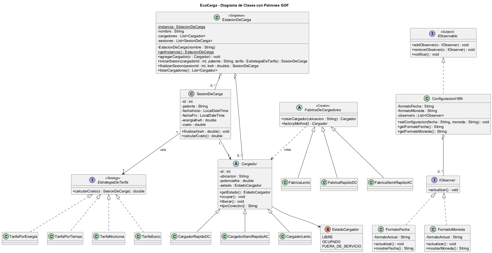
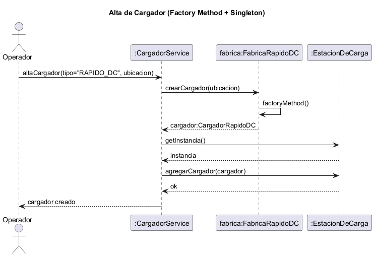
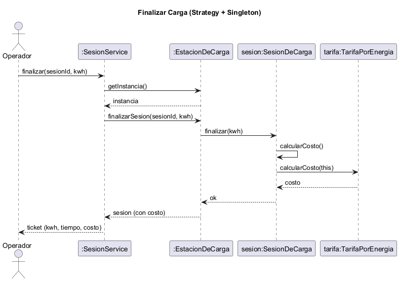
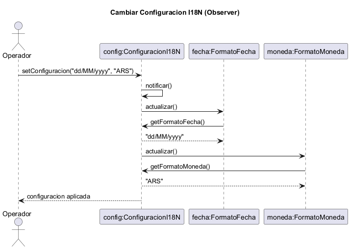

# Trabajo Final Integrador — Ingeniería de Software III

## Solución a problemas de diseño usando UML y Patrones de Diseño

**Módulo:** EcoCarga — Sistema de gestión de una estación de carga de autos eléctricos
**Integrantes:** Santiago Vicente, Josué Ferreyra, Matias Porcari, Delfina Ibañez, Candela Aguilar
**Docente:** Mgter. Marcelo Palma

---

## 1. Introducción al problema

Se desarrolla un módulo full-stack para la gestión de una **estación de carga de autos eléctricos**.
El operador puede ver el estado de los cargadores en tiempo real, iniciar y finalizar sesiones de
carga, calcular el costo según distintas tarifas, dar de alta cargadores y configurar las preferencias
de formato de fecha y moneda.

La solución aplica **cuatro patrones de diseño GOF** en el backend (Java + Spring Boot) y una interfaz
diseñada según DCU/UX/HCI en el frontend (React).

---

## 2. Solución con patrones de diseño GOF

> Contenido completo (6 puntos por patrón) en `02-patrones.md`.

### Diagrama de clases general

### 2.1 Singleton — `EstacionDeCarga`
Garantiza una única instancia de la estación y un punto de acceso global. *(Ver `02-patrones.md`.)*

### 2.2 Factory Method — creación de `Cargador`

### 2.3 Strategy — cálculo de tarifa

### 2.4 Observer — `ConfiguracionI18N`

---

## 3. Análisis de usuarios y arquitectura de la información (DCU)

> Contenido completo en `01-analisis-dcu.md`.

Usuario objetivo: **operador de la estación**. Navegación plana desde un tablero central hacia las
acciones de iniciar/finalizar carga, alta de cargador y preferencias.

---

## 4. Prototipado rápido (Wireframes)

> Wireframes de las 5 pantallas en `../wireframes/wireframes.md` (recrear en Excalidraw/draw.io y pegar
> las imágenes exportadas).

---

## 5. Defensa de la interfaz (UX / HCI)

> Contenido completo en `03-defensa-ux.md`.

Metáfora del surtidor de combustible, heurísticas de Nielsen, diseño inclusivo (color + texto) y
actualización reactiva mediante Observer.

---

## 6. Código fuente

- Backend (Java + Spring Boot) y Frontend (React): repositorio GitHub público *(a crear — Planes 2 y 3)*.

---

> **Nota de armado del Word:** este documento es la guía maestra. Para la entrega final, pegar su
> contenido en el documento Word de la cátedra (`ISWIII-Trabajo-Final-Integrador-2026.doc`) e insertar
> las imágenes PNG de `docs/uml/` en las secciones de Estructura/Colaboración de cada patrón.
