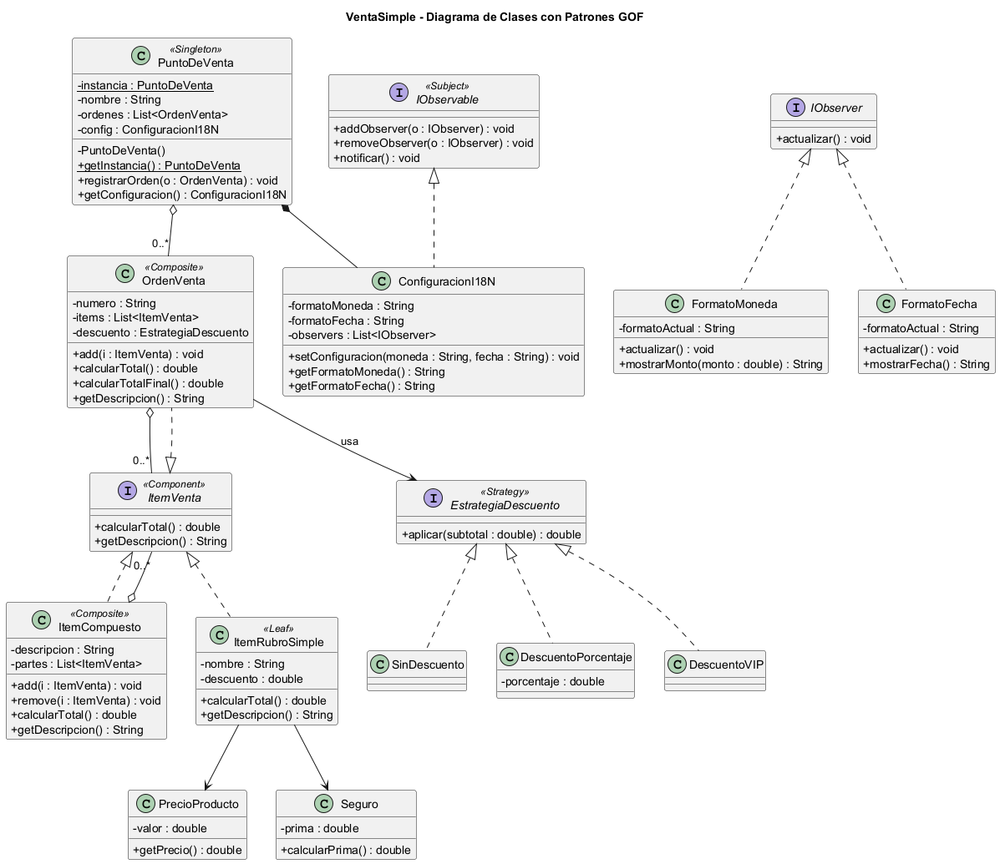
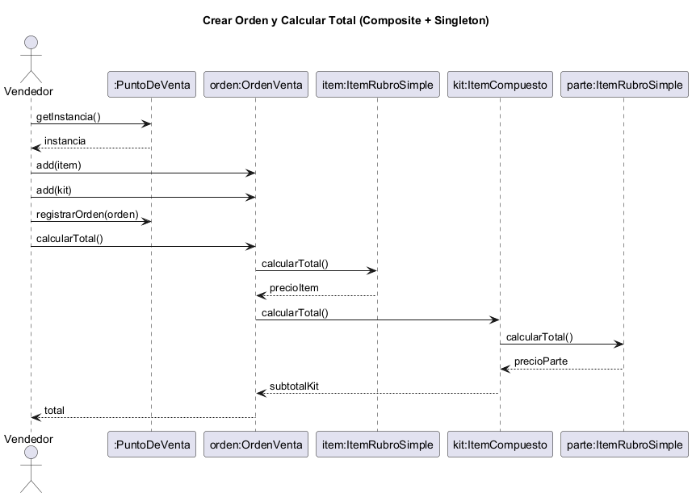
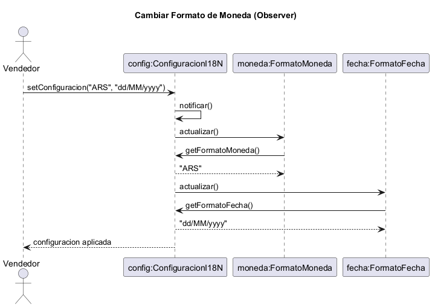
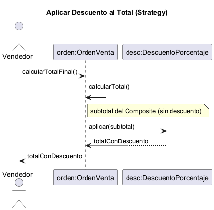

# Trabajo Final Integrador — Ingeniería de Software III

## Solución a problemas de diseño usando UML y Patrones de Diseño

**Módulo:** VentaSimple — Sistema de punto de venta (orden de venta)
**Integrantes:** Santiago Vicente, Josué Ferreyra, Matias Porcari, Delfina Ibañez, Candela Aguilar
**Docente:** Mgter. Marcelo Palma

---

## 1. Introducción al problema

Se desarrolla un módulo full-stack para un **punto de venta**. El vendedor arma una orden agregando
productos sueltos y kits (agrupaciones de productos que pueden anidarse), calcula el total, le aplica un
descuento y lo muestra con el formato de moneda configurado.

La solución aplica **cuatro patrones de diseño GOF** en el backend (Java + Spring Boot) y una interfaz
diseñada según DCU/UX/HCI en el frontend (React).

---

## 2. Solución con patrones de diseño GOF

> Contenido completo (6 puntos por patrón) en `02-patrones.md`.

### Diagrama de clases general

### 2.1 Composite — `OrdenVenta` / `ItemVenta`

### 2.2 Singleton — `PuntoDeVenta`
*(Ver `02-patrones.md` y el diagrama de clases.)*

### 2.3 Observer — `ConfiguracionI18N`

### 2.4 Strategy — `EstrategiaDescuento` (patrón nuevo)

---

## 3. Análisis de usuarios y arquitectura de la información (DCU)

> Contenido completo en `01-analisis-dcu.md`.

Usuario objetivo: **vendedor/cajero**. Navegación plana desde "Armar orden" hacia el resumen, el total
con descuento y las preferencias.

---

## 4. Prototipado rápido (Wireframes)

> Wireframes de las 4 pantallas en `../wireframes/wireframes.md` (recrear en Excalidraw/draw.io).

---

## 5. Defensa de la interfaz (UX / HCI)

> Contenido completo en `03-defensa-ux.md`.

Metáfora del carrito + ticket de caja, heurísticas de Nielsen, diseño inclusivo y actualización reactiva
mediante Observer.

---

## 6. Código fuente

- Backend (Java + Spring Boot) y Frontend (React): repositorio GitHub público
  `https://github.com/santivicente/EcoCarga` *(a desarrollar — Planes 2 y 3)*.

---

> **Nota de armado del Word:** pegar el contenido en el documento Word de la cátedra e insertar las
> imágenes PNG de `docs/uml/` en las secciones de Estructura/Colaboración de cada patrón.
