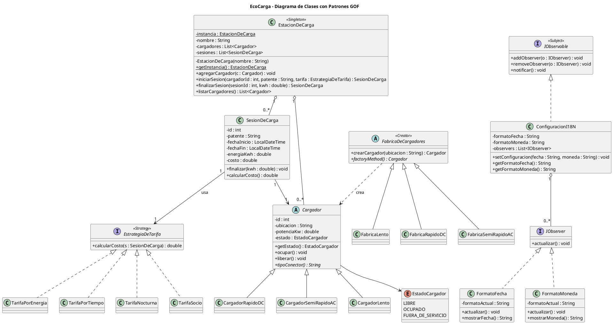
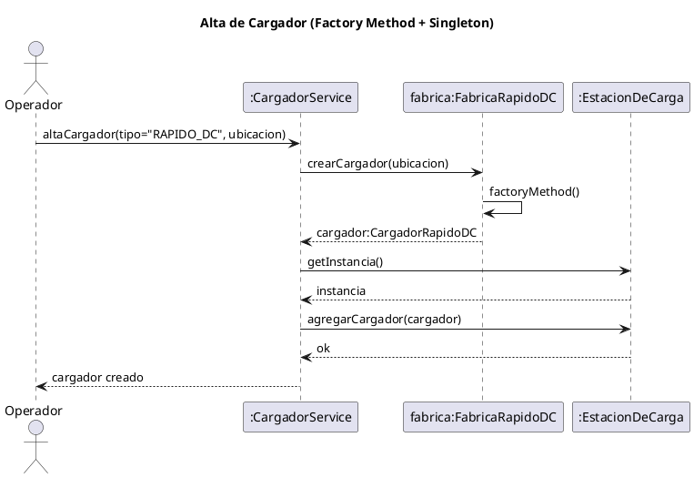
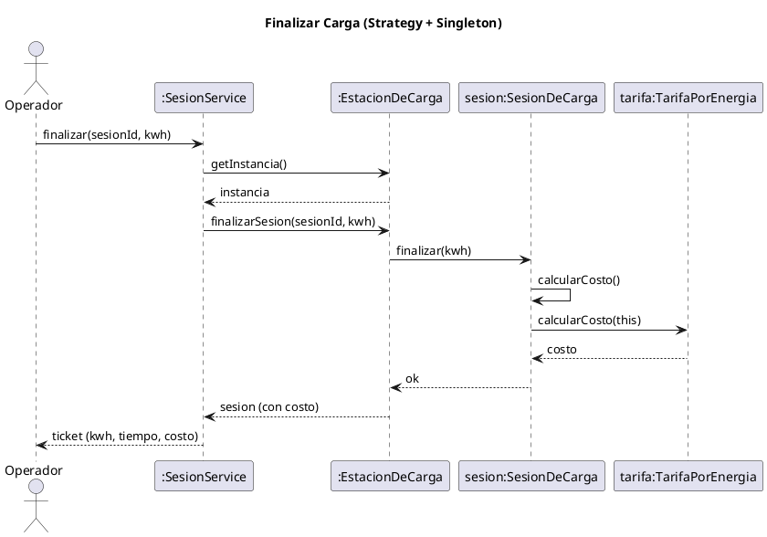
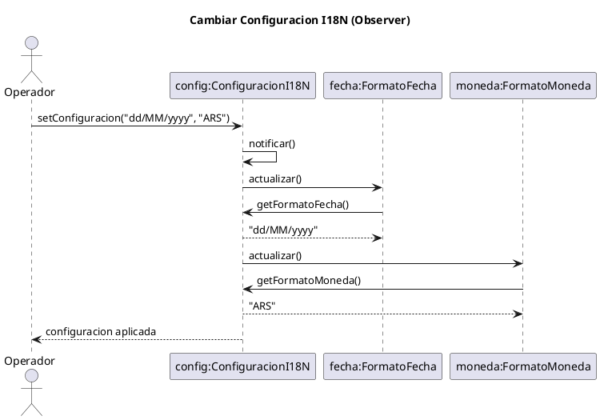

# EcoCarga — Plan 1: Análisis y Modelado UML

> **For agentic workers:** REQUIRED SUB-SKILL: Use superpowers:subagent-driven-development (recommended) or superpowers:executing-plans to implement this plan task-by-task. Steps use checkbox (`- [ ]`) syntax for tracking.

**Goal:** Producir la parte de análisis y modelado del Trabajo Final: análisis de usuario (DCU), arquitectura de información, diagrama de clases con los 4 patrones GOF y los diagramas de secuencia, más los wireframes de las 5 pantallas y el documento maestro listo para exportar a Word.

**Architecture:** Los diagramas se entregan como archivos **PlantUML** (`.puml`, texto plano) que se renderizan a imagen (plantuml.com, extensión de VS Code o importación en StarUML) y se pegan en el Word. La documentación se redacta en Markdown y se exporta a Word al final.

**Tech Stack:** PlantUML (diagramas), Markdown (documentación), Excalidraw/draw.io (wireframes a partir de las guías ASCII de este plan), Miro/FigJam (mapa de navegación).

## Global Constraints

- Idioma de todos los entregables: **español**.
- Patrones GOF a documentar (exactos): **Singleton, Factory Method, Strategy, Observer**.
- Dominio: **EcoCarga** — estación de carga de autos eléctricos.
- Cada patrón se documenta con los **6 puntos**: nombre, propósito, motivación, estructura, participantes, colaboración.
- Nombres de clases del dominio (usar idénticos en todos los diagramas y código): `EstacionDeCarga`, `Cargador`, `CargadorRapidoDC`, `CargadorSemiRapidoAC`, `CargadorLento`, `EstadoCargador`, `FabricaDeCargadores`, `SesionDeCarga`, `EstrategiaDeTarifa`, `TarifaPorEnergia`, `TarifaPorTiempo`, `TarifaNocturna`, `TarifaSocio`, `ConfiguracionI18N`, `IObservable`, `IObserver`, `FormatoFecha`, `FormatoMoneda`.
- Decisión técnica: en el patrón Observer, el método de notificación se llama `notificar()` (Subject) y `actualizar()` (Observer), **no** `notify()`, porque `Object.notify()` es `final` en Java y no se puede sobrescribir. Es una mejora respecto del ejemplo del TP11.

---

### Task 1: Estructura de carpetas e inicialización del repo

**Files:**
- Create: `docs/uml/` (carpeta para los `.puml`)
- Create: `docs/wireframes/` (carpeta para los wireframes)
- Create: `docs/entrega/` (carpeta para el documento maestro)
- Create: `.gitignore`
- Create: `README.md`

- [ ] **Step 1: Inicializar git y crear carpetas**

```bash
cd "d:/Claude/Proyectos/ProyectoIng"
git init
mkdir -p docs/uml docs/wireframes docs/entrega
```

- [ ] **Step 2: Crear `.gitignore`**

```gitignore
# Build
target/
build/
dist/
node_modules/

# IDE
.idea/
.vscode/
*.iml

# Temporales de conversión
_*.txt
```

- [ ] **Step 3: Crear `README.md`**

```markdown
# EcoCarga — Trabajo Final Integrador (ISW III)

Módulo de gestión de una estación de carga de autos eléctricos, aplicando 4 patrones de diseño GOF
(Singleton, Factory Method, Strategy, Observer) con backend Java + Spring Boot y frontend React.

## Estructura
- `docs/uml/` — diagramas PlantUML (clases y secuencia)
- `docs/wireframes/` — wireframes de las pantallas
- `docs/entrega/` — documento maestro de la entrega
- `docs/superpowers/` — spec y planes de trabajo

## Integrantes
Santiago Vicente, Josué Ferreyra, Matias Porcari, Delfina Ibañez, Candela Aguilar
```

- [ ] **Step 4: Commit**

```bash
git add .gitignore README.md docs/
git commit -m "chore: estructura inicial del proyecto y repo"
```

---

### Task 2: Diagrama de clases con los 4 patrones

**Files:**
- Create: `docs/uml/01-clases.puml`

**Interfaces:**
- Produces: el modelo de clases canónico que consumen TODOS los diagramas de secuencia y, más adelante, el código del backend. Los nombres aquí son la fuente de verdad.

- [ ] **Step 1: Crear `docs/uml/01-clases.puml`**



- [ ] **Step 2: Renderizar y verificar**

Abrir `docs/uml/01-clases.puml` en https://www.plantuml.com/plantuml (o extensión PlantUML de VS Code) y confirmar:
- Aparecen los 4 estereotipos: `<<Singleton>>`, `<<Creator>>` (Factory), `<<Strategy>>`, `<<Subject>>`.
- `EstacionDeCarga` tiene constructor privado e `instancia` estática.
- Las 3 subclases de `Cargador` y las 4 de `EstrategiaDeTarifa` están conectadas.
- El diagrama renderiza sin errores de sintaxis.

- [ ] **Step 3: Commit**

```bash
git add docs/uml/01-clases.puml
git commit -m "docs: diagrama de clases con los 4 patrones GOF"
```

---

### Task 3: Diagrama de secuencia — Alta de cargador (Factory Method)

**Files:**
- Create: `docs/uml/02-seq-alta-cargador.puml`

**Interfaces:**
- Consumes: nombres de `Cargador`, `FabricaRapidoDC`, `EstacionDeCarga` (Task 2).

- [ ] **Step 1: Crear `docs/uml/02-seq-alta-cargador.puml`**



- [ ] **Step 2: Renderizar y verificar**

Confirmar que el diagrama muestra: la fábrica creando el `CargadorRapidoDC` mediante `factoryMethod()` y la estación (Singleton) accedida por `getInstancia()`. Renderiza sin errores.

- [ ] **Step 3: Commit**

```bash
git add docs/uml/02-seq-alta-cargador.puml
git commit -m "docs: secuencia alta de cargador (Factory Method)"
```

---

### Task 4: Diagrama de secuencia — Finalizar carga (Strategy)

**Files:**
- Create: `docs/uml/03-seq-finalizar-carga.puml`

**Interfaces:**
- Consumes: `SesionDeCarga`, `EstrategiaDeTarifa`/`TarifaPorEnergia`, `EstacionDeCarga` (Task 2).

- [ ] **Step 1: Crear `docs/uml/03-seq-finalizar-carga.puml`**



- [ ] **Step 2: Renderizar y verificar**

Confirmar que el cálculo del costo se delega en la estrategia `TarifaPorEnergia` vía `calcularCosto(this)`. Renderiza sin errores.

- [ ] **Step 3: Commit**

```bash
git add docs/uml/03-seq-finalizar-carga.puml
git commit -m "docs: secuencia finalizar carga (Strategy)"
```

---

### Task 5: Diagrama de secuencia — Cambiar configuración I18N (Observer)

**Files:**
- Create: `docs/uml/04-seq-configuracion.puml`

**Interfaces:**
- Consumes: `ConfiguracionI18N`, `FormatoFecha`, `FormatoMoneda` (Task 2).

- [ ] **Step 1: Crear `docs/uml/04-seq-configuracion.puml`**



- [ ] **Step 2: Renderizar y verificar**

Confirmar el modelo **pull**: `notificar()` llama `actualizar()` en cada observador y cada uno consulta el valor al Subject. Renderiza sin errores.

- [ ] **Step 3: Commit**

```bash
git add docs/uml/04-seq-configuracion.puml
git commit -m "docs: secuencia configuracion I18N (Observer)"
```

---

### Task 6: Análisis de usuario y arquitectura de información (DCU)

**Files:**
- Create: `docs/entrega/01-analisis-dcu.md`

- [ ] **Step 1: Crear `docs/entrega/01-analisis-dcu.md`**

```markdown
# Análisis de Usuarios y Arquitectura de la Información (DCU)

## Persona: "Lucía, operadora de estación"
- **Contexto:** atiende la estación de carga; trabaja de pie, a veces de noche o con apuro.
- **Objetivos:** ver al instante qué cargador está libre, iniciar una carga y cobrar rápido.
- **Frustraciones:** pantallas recargadas, pasos de más, no distinguir estados de un vistazo.
- **Necesidades de diseño:** estados muy visibles (color + texto), botones grandes, flujos cortos.

## Tareas principales (análisis Top-Down)
1. Ver disponibilidad de cargadores.
2. Iniciar una carga (cargador + tarifa + patente).
3. Finalizar una carga y emitir el ticket con el costo.
4. Dar de alta un cargador.
5. Ajustar preferencias de formato (fecha/moneda).

## Arquitectura de la información / Mapa de navegación
\`\`\`
Tablero (home)
 ├─ Iniciar carga ──────────► Ticket
 ├─ Finalizar carga (desde un cargador ocupado) ──► Ticket
 ├─ Alta de cargador
 └─ Preferencias (I18N)
\`\`\`
Navegación plana (1 nivel) desde el Tablero, para minimizar la carga cognitiva.

> Recrear este mapa en **Miro o FigJam** para la entrega (captura del tablero de navegación).
```

- [ ] **Step 2: Verificar**

Confirmar que el documento cubre: persona, tareas (Top-Down) y mapa de navegación. Coincide con la Sección 5 del spec.

- [ ] **Step 3: Commit**

```bash
git add docs/entrega/01-analisis-dcu.md
git commit -m "docs: analisis de usuario y arquitectura de informacion (DCU)"
```

---

### Task 7: Wireframes de las 5 pantallas (guía ASCII)

**Files:**
- Create: `docs/wireframes/wireframes.md`

- [ ] **Step 1: Crear `docs/wireframes/wireframes.md`**

````markdown
# Wireframes de baja fidelidad — EcoCarga

> Recrear en **Excalidraw o draw.io** a partir de estas guías y exportar como imagen para el Word.
> Regla de diseño inclusivo: todo estado se comunica por **color + texto/ícono** (no solo color).

## 1. Tablero de cargadores (home)
```
┌───────────────────────────────────────────────┐
│ EcoCarga              [ Preferencias ⚙ ]        │
├───────────────────────────────────────────────┤
│  Cargadores                  [ + Alta cargador ]│
│                                                 │
│  ┌──────────┐  ┌──────────┐  ┌──────────┐       │
│  │Surtidor 1│  │Surtidor 2│  │Surtidor 3│       │
│  │ 🟢 LIBRE │  │ 🔴 OCUP. │  │ ⚫ F.SERV.│       │
│  │ 50 kW DC │  │ 22 kW AC │  │  7 kW    │       │
│  │[ Iniciar]│  │[Finaliz.]│  │          │       │
│  └──────────┘  └──────────┘  └──────────┘       │
└───────────────────────────────────────────────┘
```

## 2. Iniciar carga
```
┌───────────────────────────────────┐
│ ← Iniciar carga — Surtidor 1       │
├───────────────────────────────────┤
│ Patente:   [ ABC123        ]       │
│ Tarifa:    [ Por energía  ▾]       │
│                                    │
│           [  Iniciar carga  ]      │
└───────────────────────────────────┘
```

## 3. Ticket de carga (al finalizar)
```
┌───────────────────────────────┐
│        ⚡ Ticket de carga       │
├───────────────────────────────┤
│ Surtidor 1 — ABC123            │
│ Inicio:  26/06/2026 14:05      │
│ Fin:     26/06/2026 14:50      │
│ Energía: 28,5 kWh              │
│ ─────────────────────────────  │
│ TOTAL:   $ 12.450,00           │
│           [  Cerrar  ]         │
└───────────────────────────────┘
```

## 4. Alta de cargador
```
┌───────────────────────────────────┐
│ ← Alta de cargador                 │
├───────────────────────────────────┤
│ Ubicación: [ Surtidor 4     ]      │
│ Tipo:      [ Rápido DC      ▾]     │
│            (Rápido DC / Semi AC /  │
│             Lento)                 │
│            [  Crear cargador  ]    │
└───────────────────────────────────┘
```

## 5. Preferencias (I18N)
```
┌───────────────────────────────────┐
│ ← Preferencias                     │
├───────────────────────────────────┤
│ Formato de fecha:  [ dd/MM/yyyy ▾] │
│ Formato de moneda: [ ARS ($)    ▾] │
│                                    │
│ Vista previa:                      │
│   Fecha:  26/06/2026               │
│   Monto:  $ 12.450,00              │
│            [  Guardar  ]           │
└───────────────────────────────────┘
```
````

- [ ] **Step 2: Verificar**

Confirmar que están las 5 pantallas del MVP y que los estados usan color **y** texto (diseño inclusivo).

- [ ] **Step 3: Commit**

```bash
git add docs/wireframes/wireframes.md
git commit -m "docs: wireframes de baja fidelidad de las 5 pantallas"
```

---

### Task 8: Documento maestro de patrones (6 puntos c/u) + defensa UX

**Files:**
- Create: `docs/entrega/02-patrones.md`
- Create: `docs/entrega/03-defensa-ux.md`

**Interfaces:**
- Consumes: los diagramas de Tasks 2-5 (se referencian por nombre de archivo).

- [ ] **Step 1: Crear `docs/entrega/02-patrones.md`**

Redactar, para cada uno de los 4 patrones, los 6 puntos de la consigna (nombre, propósito, motivación, estructura, participantes, colaboración), usando como base la Sección 4 del spec (`docs/superpowers/specs/2026-06-26-ecocarga-design.md`) y referenciando el diagrama correspondiente:
- Singleton → `docs/uml/01-clases.puml`
- Factory Method → `docs/uml/01-clases.puml` + `docs/uml/02-seq-alta-cargador.puml`
- Strategy → `docs/uml/01-clases.puml` + `docs/uml/03-seq-finalizar-carga.puml`
- Observer → `docs/uml/01-clases.puml` + `docs/uml/04-seq-configuracion.puml`

Mantener el mismo formato y nivel de detalle que los TP de referencia (TP6 y TP11).

- [ ] **Step 2: Crear `docs/entrega/03-defensa-ux.md`**

Volcar la Sección 7 del spec (defensa UX/HCI): metáfora del surtidor, heurísticas de Nielsen aplicadas, diseño inclusivo (color + texto), actualización reactiva (Observer). Dejar marcada la nota de confirmar el vocabulario con el material de cátedra `ISWIII-U3-HCI.pdf`.

- [ ] **Step 3: Verificar**

Confirmar que `02-patrones.md` tiene los 6 puntos por cada uno de los 4 patrones y que cada patrón referencia su(s) diagrama(s).

- [ ] **Step 4: Commit**

```bash
git add docs/entrega/02-patrones.md docs/entrega/03-defensa-ux.md
git commit -m "docs: documento maestro de patrones y defensa UX"
```

---

### Task 9: Ensamblar y exportar el documento Word de entrega

**Files:**
- Create: `docs/entrega/EcoCarga-Entrega.md` (documento maestro unificado)

- [ ] **Step 1: Crear `docs/entrega/EcoCarga-Entrega.md`**

Unificar en un solo documento, en este orden: portada (materia, tema, integrantes), introducción al problema, los 4 patrones (`02-patrones.md`), análisis DCU (`01-analisis-dcu.md`), wireframes (imágenes exportadas), defensa UX (`03-defensa-ux.md`) e indicación del repo GitHub. Insertar las imágenes renderizadas de los `.puml` en la sección Estructura/Colaboración de cada patrón.

- [ ] **Step 2: Exportar a Word**

Pegar el contenido en el documento Word de la cátedra (`ISWIII-Trabajo-Final-Integrador-2026.doc`) o, si hay pandoc disponible, convertir; si no, copiar/pegar manteniendo títulos. Verificar que las imágenes de los diagramas estén insertadas.

- [ ] **Step 3: Commit**

```bash
git add docs/entrega/EcoCarga-Entrega.md
git commit -m "docs: documento maestro de entrega unificado"
```

---

## Verificación final del Plan 1 (cobertura de la consigna)

- [x] Punto 1-6 por patrón → Tasks 2-5 (diagramas) + Task 8 (texto).
- [x] Punto 7 Análisis de usuarios y AI (DCU) → Task 6.
- [x] Punto 8 Wireframes/Mockups → Task 7.
- [x] Punto 9 Defensa de la interfaz (UX/HCI) → Task 8.
- [ ] Punto 10 Código Java/Spring Boot + React → **Plan 2 (Backend) y Plan 3 (Frontend)**.

## Próximos planes
- **Plan 2 — Backend Spring Boot:** implementar los 4 patrones + API REST, con TDD.
- **Plan 3 — Frontend React:** las 5 pantallas consumiendo la API.
